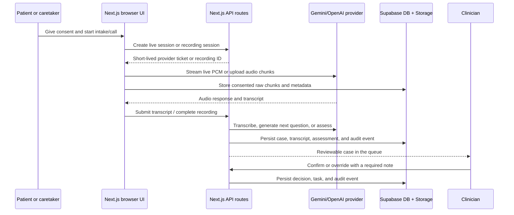

# Architecture

## System purpose

24 Care is a web-first care-intake workspace. The patient or caretaker starts a consented request; the voice or guided-intake path produces evidence; a deterministic policy layer prepares a priority; and an authenticated clinician confirms or overrides the proposed action.

The application deliberately separates model output from care action. AI output is evidence for review, not a clinical decision.

## Runtime components

| Component | Location | Responsibility | Trust boundary |
| --- | --- | --- | --- |
| Next.js web app | `app/`, `components/` | Patient, caretaker, and clinician UI; server routes; browser microphone capture | Browser is untrusted; never place service credentials here |
| Custom auth | `lib/custom-auth.ts`, `lib/auth-cookies.ts`, `app/api/auth/` | Google identity exchange, application user/session records, access and refresh cookies | Server-only signing and Supabase service access |
| Application session | `lib/server-session.ts` | Verifies the short-lived access JWT and rotates refresh sessions | HTTP-only cookies are the only browser session transport |
| Policy engine | `lib/triage.ts`, `lib/clinical-policy.ts` | Deterministic fictional policy matching and priority preparation | Must not be described as diagnosis or autonomous triage |
| AI provider adapter | `lib/ai-provider.ts`, `lib/care-agent.ts` | Recorded transcription and follow-up question generation | Provider credentials remain server-side |
| Gemini Live gateway | `voice-gateway.ts` | Validates a short-lived JWT, opens Vertex Live WebSocket, forwards PCM audio, returns audio/transcripts | Browser never receives ADC credentials |
| Optional LiveKit worker | `agent/` | Experimental clinician-console transport | Not required by the first-party patient recording path |
| Supabase PostgreSQL | `supabase/migrations/` | Users, cases, consent, transcripts, assessments, decisions, tasks, audit | RLS and server authorization constrain access |
| Supabase Storage | Private `care-audio` bucket | Raw audio chunks | Private bucket; object paths begin with the initiating user ID |

## Request lifecycle



## Patient and caretaker paths

### Guided web intake

1. The user selects Patient or Caretaker in demo mode, or receives the role from the authenticated profile.
2. The user enters a case alias and callback reference.
3. The user accepts the intake notice.
4. Three structured questions are shown one at a time. Browser speech synthesis can read a question; it is not a provider call.
5. The client creates a transcript from the answers and calls `POST /api/cases` when the user is authenticated.
6. The server computes the deterministic assessment and policy result, then persists the case, consent record, transcript, assessment, and audit event.

### Recorded AI call

1. The authenticated user accepts recording consent.
2. `POST /api/recordings` creates a `call_recording` row with status `recording`.
3. `MediaRecorder` emits browser audio chunks.
4. Each chunk is sent sequentially to `/api/recordings/{id}/chunks`.
5. The server writes the raw object to private Supabase Storage, records the chunk metadata, and processes the audio through the selected provider unless `rawOnly=true` is used.
6. The processed transcript is appended to the case when the recording is linked to a case.
7. `POST /api/recordings/{id}/complete` marks the recording ready and records its duration.
8. The completed transcript is assessed and submitted for clinician review.

### Live AI call

1. The authenticated user accepts live-call consent.
2. `POST /api/live/session` creates a short-lived provider session. It never returns a long-lived provider credential.
3. For Gemini, the browser receives a two-minute application JWT ticket and connects to `LIVE_GATEWAY_URL`; the gateway uses ADC to connect to Vertex AI.
4. The browser converts microphone audio to 16 kHz PCM and sends it through the gateway or OpenAI WebRTC path.
5. Response audio is played immediately and transcript events are displayed.
6. Raw browser audio is recorded in parallel and uploaded to private Storage.
7. Pressing **End call** stops the provider, microphone, and recorder; waits for queued uploads; completes the recording; and submits the transcript for assessment and clinician review.

## Provider boundary

`AI_PROVIDER` selects `gemini` or `openai`.

### Gemini

- Recorded processing: `GEMINI_MODEL`, currently `gemini-3.8-flash`.
- Live voice: `GEMINI_LIVE_MODEL`, currently `gemini-3.8-live` through the ADC gateway.
- Credentials: Google Application Default Credentials on the server/gateway.
- Malayalam behavior: live and recorded prompts are Malayalam-first; mixed Malayalam/English callers receive Malayalam replies unless they explicitly request English.

### OpenAI

- Recorded processing: server-side transcription and Responses API calls.
- Live voice: browser WebRTC using a short-lived client secret created by the server.
- Credentials: `OPENAI_API_KEY` remains server-only.
- The application-level policy, consent, clinician confirmation, and audit behavior are provider-independent.

## Persistence and authorization

The primary tables are:

- `app_user`, `app_session`: custom Google OAuth application identity and refresh-session storage.
- `profiles`: application role profile linked to the application user ID.
- `caretaker_patient`: active caretaker-to-patient relationships.
- `care_case`: case alias, patient, initiator, callback reference, priority, status, and triage output.
- `consent_record`: intake and recording consent with notice version.
- `transcript_segment`: caller, assistant, clinician, or system evidence with `ml`, `en`, or `mixed` language.
- `assessment`: provider output and policy version.
- `clinical_decision`: clinician confirmation or override and required note.
- `care_task`: action created only after clinician decision.
- `audit_event`: case activity history.
- `call_recording`, `call_recording_chunk`: raw audio metadata, ordered chunk paths, and processed transcript fragments.

The migration hardening moves authorization functions into the `private` schema. RLS limits case access to the patient, initiating user, an active caretaker relationship, or a review role. Clinician, care coordinator, and admin roles can review cases. Service-role access is server-only.

## State transitions

### Case

```text
created → review → confirmed → task created
                 └→ overridden → task created
```

Cases can also be closed by a future operational workflow. The current decision route only accepts `confirmed` or `overridden`.

### Recording

```text
recording → processing → ready
                     └→ failed
```

A failed chunk or provider operation must not be treated as a complete clinical record. The current MVP reports the failure to the caller; production needs retry, reconciliation, and retention workers.

## Design invariants

1. Consent is required before live sessions or recordings are created.
2. Browser code never receives a Supabase service-role key, Google ADC credential, OpenAI API key, or long-lived provider token.
3. Raw audio is stored only in the private `care-audio` bucket.
4. Every persisted case has a policy version and audit trail.
5. AI output never creates a care task without a clinician decision.
6. Emergency language tells the caller to contact local emergency services; the system does not dispatch help.
7. Demo local storage and demo role cookies are not production identity or persistence.
